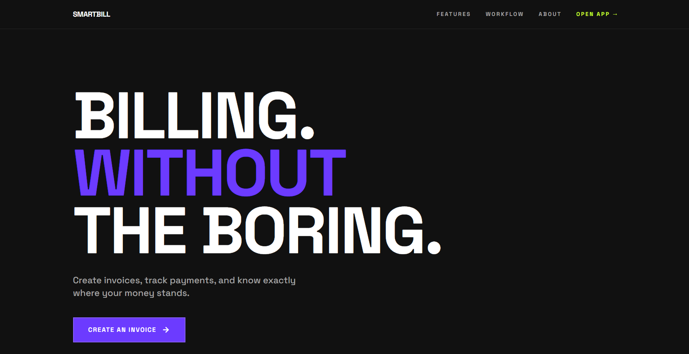
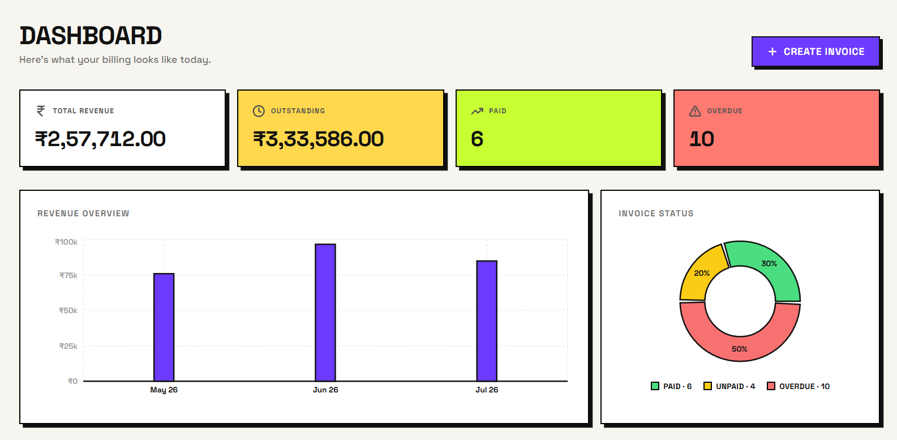

# SmartBill

> A polished full-stack invoice and billing application with a neo-brutalist design.



[](https://neo-smart-bill.vercel.app)
[](https://vercel.com)
[](https://render.com)

---

## Overview

SmartBill is a full-stack billing application built as a developer assessment project. It covers the complete invoice lifecycle — from creation to payment tracking — with a clean, opinionated UI and a well-structured backend.



---

## Features

| Feature | Description |
|---|---|
| 🧾 Invoice Management | Create, edit, view, delete invoices with line items |
| 👥 Customer Management | CRUD for customers, auto-created on invoice save |
| 🏢 Business Profiles | Save multiple business profiles, auto-fill on new invoice |
| 📊 Dashboard | Revenue bar chart, status pie chart, recent invoices |
| 💰 Live Calculations | Tax, discount, and totals recalculated on the backend |
| 🔐 Authentication | JWT-based signup and signin |
| 🖨️ Print View | Clean print-friendly invoice detail page |
| ₹ INR Support | All amounts in Indian Rupees |

---

## Tech Stack

**Frontend**
- React 18 + TypeScript
- Vite
- Tailwind CSS (neo-brutalist design system)
- React Router v6
- Recharts
- Lucide Icons

**Backend**
- Node.js + Express + TypeScript
- Prisma ORM
- PostgreSQL
- Zod validation
- JWT authentication
- Docker

---

## Architecture

The backend follows an MVC-oriented structure:

```
server/src/
├── controllers/   # Request handling and response shaping
├── services/      # Business logic and orchestration
├── validators/    # Zod-based input validation
├── middleware/    # Centralized error handling, auth guard
└── utils/         # Invoice calculations, monetary helpers
```

**Key design decisions:**
- Invoice values stored as **snapshots** — historical invoices stay consistent even if prices change
- Totals **recalculated on the backend** before saving — server is the source of truth
- Monetary values stored as **integer minor units** (paise) to avoid floating-point drift

---

## API Endpoints

```
GET     /api/health
GET     /api/invoices
GET     /api/invoices/stats
GET     /api/invoices/:id
POST    /api/invoices
PUT     /api/invoices/:id
PATCH   /api/invoices/:id/status
DELETE  /api/invoices/:id
GET     /api/customers
POST    /api/customers
PUT     /api/customers/:id
DELETE  /api/customers/:id
POST    /api/auth/signup
POST    /api/auth/signin
```

---

## Local Setup

**1. Clone**
```bash
git clone https://github.com/Akshar-bhakare/SmartBill.git
cd SmartBill
```

**2. Start PostgreSQL**
```bash
docker compose up postgres -d
```

**3. Backend**
```bash
cd server
npm install
npx prisma migrate dev --name init
npm run prisma:seed
npm run dev
```

**4. Frontend**
```bash
cd client
npm install
npm run dev
```

Frontend → `http://localhost:5173`  
Backend → `http://localhost:5000`

---

## Environment Variables

**server/.env**
```
PORT=5000
NODE_ENV=development
DATABASE_URL=postgresql://...
CORS_ORIGIN=http://localhost:5173
JWT_SECRET=your-secret
```

**client/.env**
```
VITE_API_URL=http://localhost:5000
```

---

## Test Credentials

```
Email:    test@gmail.com
Password: Pass@123
```

---

## Deployment

| Service | Platform |
|---|---|
| Frontend | Vercel |
| Backend | Render (Web Service) |
| Database | Render (PostgreSQL) |
